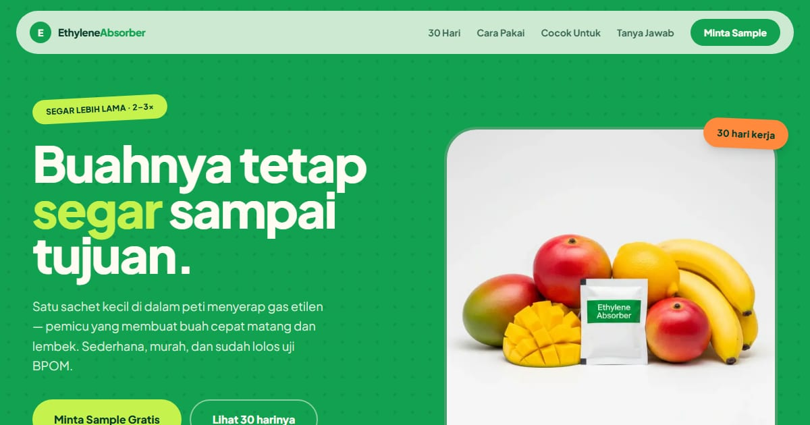

# EthyleneAbsorber — Konsep Segar | Dickson Synergy

Landing page EthyleneAbsorber konsep "Segar": jaga kesegaran buah lebih lama dengan teknologi ethylene absorber berkualitas tinggi.

**Demo live:** https://absorber-segar.vercel.app



> Konsep desain untuk kontes brief EthyleneAbsorber (PT Dickson Synergy), bukan situs resmi perusahaan. Formulir di dalamnya tidak mengirim data.

## Konsep

Konsep "Segar" dengan bahasa rupa **Pasar Pagi**, meniru poster pedagang buah: stiker miring, tepi bergerigi, dan kalender 30 hari yang menandai tambahan umur simpan dari sachet. Sengaja jadi kandidat yang paling lantang.

## Halaman

`/` · `/faq` · `/kontak` · `/privacy` · `/terms`

## Teknologi

- Next.js 15.5 (App Router) dan React 19
- Tailwind CSS v4
- TypeScript
- Framer Motion, Lucide (ikon)
- Font: Plus Jakarta Sans (next/font)
- SEO: metadata per halaman, Open Graph, JSON-LD, sitemap.xml, dan robots.txt

## Menjalankan secara lokal

```bash
npm install
npm run dev
```

Buka http://localhost:3000. Untuk build produksi: `npm run build` lalu `npm start`.

---

Bagian dari koleksi 9 entri kontes desain web di [PortalKontes](https://portal-kontes.vercel.app). Dibuat oleh [PintuWeb](https://pintuweb.com), jasa pembuatan website.
